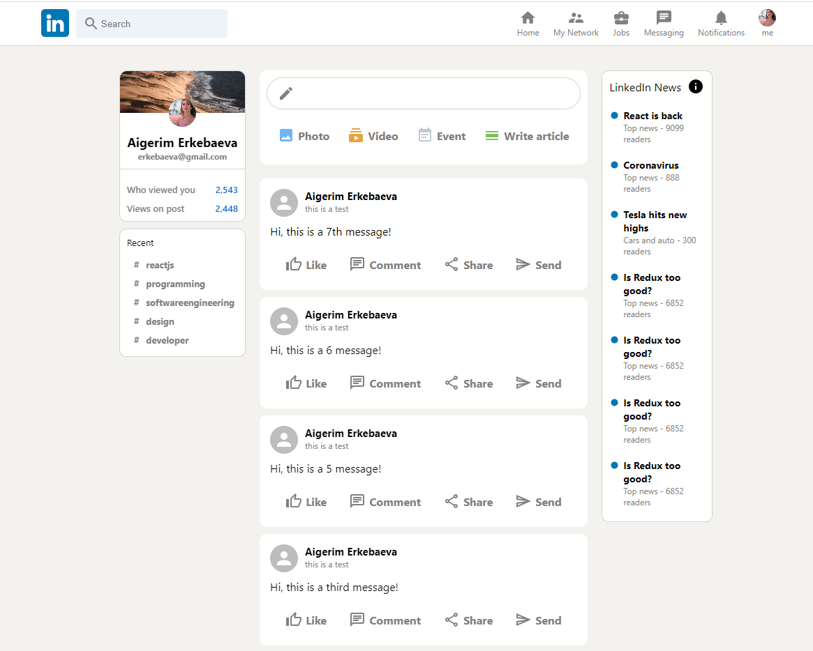

# LinkedIn clone
> This project is a LinkedIn clone, where you can send your post to feed
> Live demo [_here_](https://linkedin-clone-f5260.web.app/)

## Table of Contents
* [General Info](#general-information)
* [Technologies Used](#technologies-used)
* [Features](#features)
* [Screenshots](#screenshots)
* [Setup](#setup)


## General Information
- The purpose of this project is to imitate posting a post on LinkedIn


## Technologies Used
    "react": "^18.2.0",
    "react-dom": "^18.2.0",
    "react-flip-move": "^3.0.4",
    "react-redux": "^8.0.4",
    @mui/icons-material": "^5.10.9",
    "@mui/material": "^5.10.11",
    "@reduxjs/toolkit": "^1.8.6",
    "firebase": "^9.13.0",
    


## Features
- Write a post
- Send to a feed


## Screenshots



## Setup
After you clone this repo to your desktop, go to its root directory and run ```npm install``` to install its dependencies.
Once the dependencies are installed, you can run ```npm start``` to start the application. You will then be able to access it at localhost:3000
